  <h1 align="center"> Olá, eu sou o Thiago 👋   </h1>

  <h3 align="center"> Programação && Engenharia Química </h3>

  

    
  

  
 
    <a href="https://thpsouza.github.io/equilibrio-etanol-agua-html">
        🔬 <strong>Calculadora Interativa — Equilíbrio termodinâmico Etanol/Água</strong> 
    </a>
  

  ## 💻 Habilidades:

  

    
  

  

    
    
    
    
  

  

    
📊 GitHub Stats:

     
    

      <!--  -->
      
    

  

  ## 👤 Sobre mim:

  - 🎓 Estudante de Engenharia Química - **UFRJ**.
  - 📐 Tenho Interesse nas áreas de **fenômenos de transporte, termodinâmica, modelagem, métodos numéricos e simulação.**
  - 💻 Utilizo a programação para resolver problemas de engenharia e desenvolver projetos pessoais.
  - 🔭 Atualmente explorando o campo de **Aprendizado de Máquina**.

  <!-- 
  Sou estudante de **Engenharia Química pela UFRJ**. Utilizo a **programação** como ferramenta para resolver problemas relacionados à minha área, bem como para desenvolver meu próprios projetos pessoais.

  Áreas de interesse na Engenharia:
  - 📐 Modelagem;
  - 🌊 Fenômenos de transporte;
  - 🔥 Termodinâmica;
  - 🧮 Métodos numéricos;
  - 📊 Simulação numérica;
  - 🤖 Aprendizado de Máquina. 
  -->

  ### 📫 Contato:
  - 🔗 [LinkedIn](https://www.linkedin.com/in/thiago-p-de-souza)
  - 📧 thiagosouza@eq.ufrj.br

  ## 📁 Projetos:

